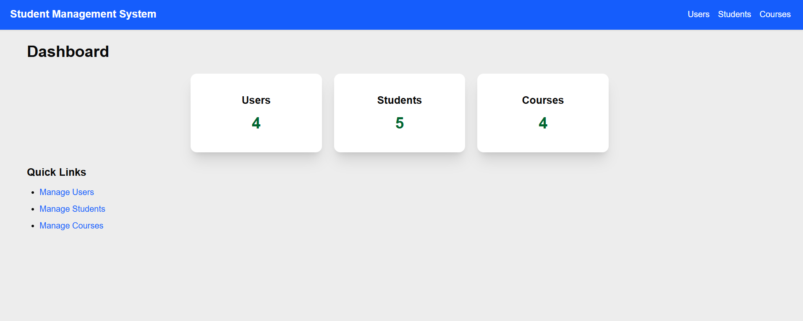
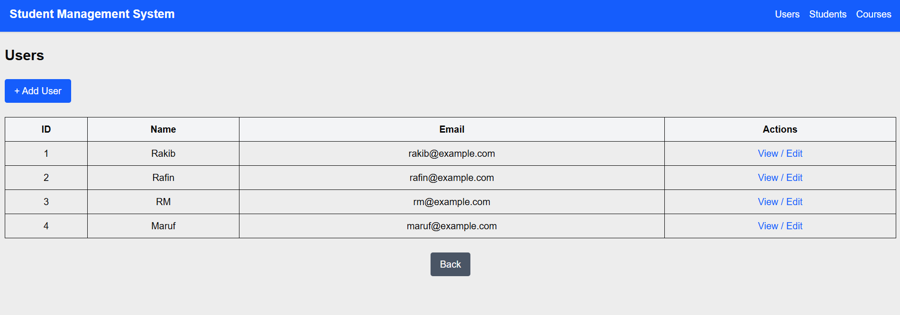

# Next.js Full-Stack CRUD Application (Users, Students, Courses)

This project is a **full-stack CRUD application** built with **Next.js 15 (App Router)** and **MySQL**. It demonstrates how to manage **Users, Students, Courses**, and their relationships (assigning students to courses).

---

## Features

- **Users**

  - Create, Read, Update, Delete users

- **Students**

  - Manage students with CRUD operations

- **Courses**

  - Manage courses with CRUD operations

- **Assignments**

  - Assign students to courses
  - View students enrolled in each course

- **Dashboard**

  - Summary of Users, Students, Courses, Assignments

---

## Tech Stack

- **Frontend:** Next.js (App Router, Client Components)
- **Backend:** Next.js API routes
- **Database:** MySQL
- **Styling:** Tailwind CSS (optional - you can use plain CSS)

---

## Installation & Setup

### Clone the repository

```bash
git clone https://github.com/Fa-had/student-management-system.git
cd student-management-system
```

### Install dependencies

```bash
npm install
```

---

## Database Setup

You need **MySQL** installed. You can use either **XAMPP** (recommended for beginners) or **MySQL Workbench**.

The SQL files for creating and seeding the database are in `database/schema.sql` and `database/seed.sql`.

### 🔹 Option A — Using XAMPP (phpMyAdmin)

1. Start **Apache** and **MySQL** from the XAMPP control panel.
2. Open `http://localhost/phpmyadmin/` in your browser.
3. Import the schema file: (run schema)
   - Click the **Import** tab → **Choose file** → select `database/schema.sql` → **Go**.
4. (Optional) Import seed data the same way using `database/seed.sql`. or (run seed data)

### 🔹 Option B — Using MySQL Workbench

1. Open **MySQL Workbench** and connect to your local MySQL server.
2. Open and run the SQL statements in `database/schema.sql`.
3. (Optional) Run `database/seed.sql` to insert sample data.

---

## Database Configuration

You can configure database credentials in one of two ways:

1. Edit `app/api/db.ts` directly (quick local setup), **or**
2. Use environment variables by creating a `.env.local` file at the repository root and update `app/api/db.ts` to read from `process.env`.

### Example: `.env.local`

```
DB_HOST=localhost
DB_USER=root
DB_PASS=YOUR_PASSWORD
DB_NAME=student_management
```

### Example: `app/api/db.ts` (using `mysql2/promise`)

```ts
import mysql from 'mysql2/promise'

const pool = mysql.createPool({
  host: process.env.DB_HOST || 'localhost',
  user: process.env.DB_USER || 'root',
  password: process.env.DB_PASS || '',
  database: process.env.DB_NAME || 'student_management',
  waitForConnections: true,
  connectionLimit: 10,
})

export default pool
```

> **Note:** Default XAMPP MySQL user is `root` with an empty password. If you change credentials, update `.env.local` or `db.ts` accordingly.

---

## Running the Project

Start the Next.js development server:

```bash
npm run dev
```

Open your browser at: `http://localhost:3000`

---

## Project Structure

```structure
app/
 ├─ api/               # API routes for CRUD
 │   ├─ users/         # GET/POST, [id] GET/PUT/DELETE
 │   ├─ students/      # GET/POST, [id] GET/PUT/DELETE
 │   ├─ courses/       # GET/POST, [id] GET/PUT/DELETE
 │   ├─ student-courses/ # POST to assign student to course
 │   └─ summary/       # GET summary counts for dashboard
 ├─ users/             # User pages (list, create, detail)
 ├─ students/          # Student pages (list, create, detail)
 ├─ courses/           # Course pages (list, create, detail, assign, students)
 ├─ layout.tsx         # Root layout
 └─ page.tsx           # Dashboard

database/
 ├─ schema.sql         # Database schema
 └─ seed.sql           # Sample data

README.md
```

---

## database/schema.sql

The `database/schema.sql` included in the repo creates these tables:

- `users` (id, name, email, created_at)
- `students` (id, name, email, enrollment_date, created_at)
- `courses` (id, title, description, created_at)
- `student_courses` (id, student_id, course_id, assigned_at)

You can open `database/schema.sql` to view exact SQL statements.

---

## database/seed.sql

The `database/seed.sql` file contains sample inserts for users, students, courses, and student-course assignments so you can test the app quickly.

---

## Quick Usage

- Dashboard: `http://localhost:3000` — summary and quick links
- Users: `http://localhost:3000/users`
- Students: `http://localhost:3000/students`
- Courses: `http://localhost:3000/courses`

---

## Screenshots




---

## Author

- Developed by **Fahad**
- GitHub: [https://github.com/Fa-had](https://github.com/Fa-had)
